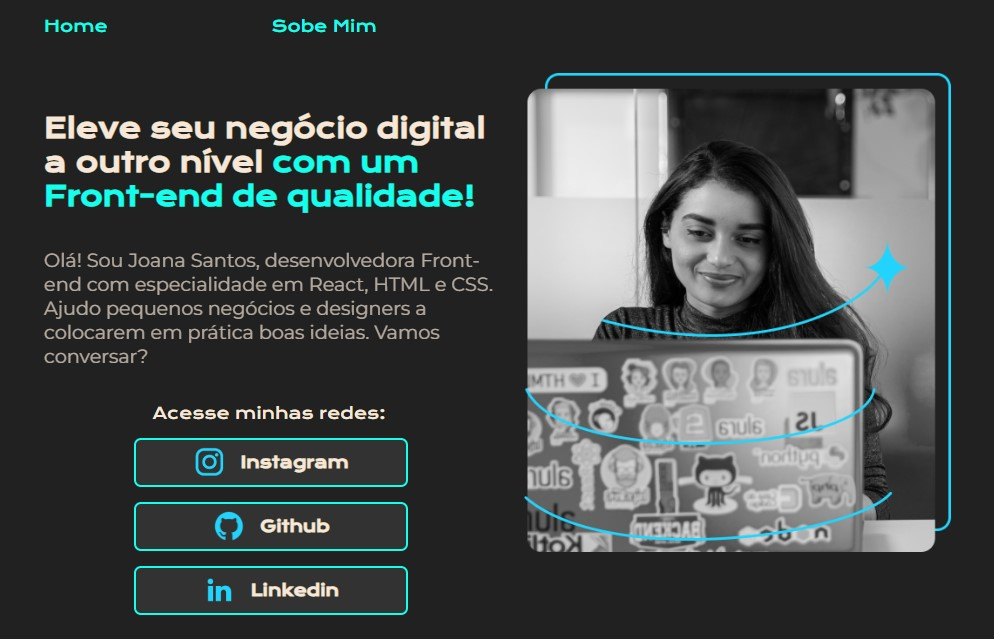
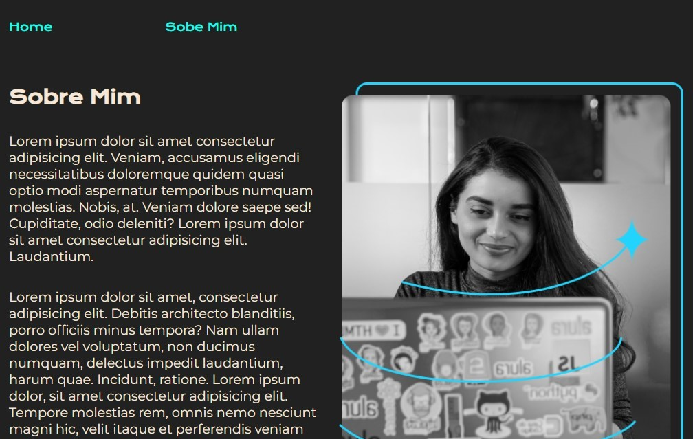

# Portfólio de Joana Santos

## Bem-vindo! 👋
Obrigado por ver meu projeto!

## Descrição do projeto 😀
Esse projeto aborda sobre o portfólio de Joana Santos, feito com a ajuda da plataforma Alura.

## Tem algum feedback? 😁
Adoro receber feedbacks! Estou sempre buscando melhorar meus projetos. Então, se você tiver algo que gostaria de mencionar, envie um e-mail para evex12324@gmail.com!

## Tecnologias utilizadas
Foi utilizado no projeto o uso de Botões, Links, Âncoras, Responsividade e Imagens.

## Contribuidores
Alura

## Autor do projeto.
Pedro de Carvalho

**Compartilhe este repositório!** 🚀
